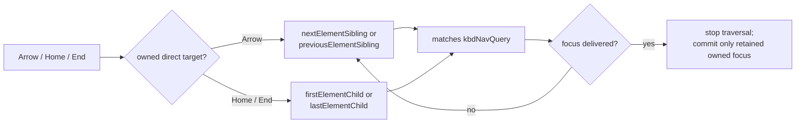
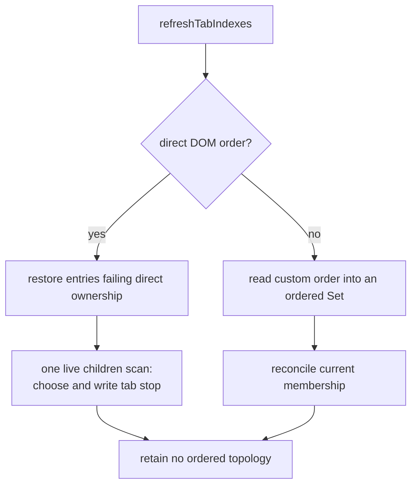

# Keyboard Navigation Mixin

`KeyboardNavMixin` implements roving `tabindex` and Arrow/Home/End navigation
for composite components. It keeps one managed tab stop, follows current owned
order, and restores authored `tabindex` values when management ends.

## Public contract

- `kbd-nav` enables or disables roving keyboard navigation.
- `kbdNavQuery` selects the default direct-child targets.
- `ariaOrientationDefault` selects vertical or horizontal arrow handling.
- `focusCurrentOrFirst()`, `focusNext()`, `focusPrevious()`, `focusFirst()`, and
  `focusLast()` move focus through the owned order and return only a target that
  received focus or the final owned target of a synchronous redirect.
- `refreshTabIndexes()` explicitly reconciles target membership and tab stops.

The default DOM ownership boundary is the host's **direct element children**.
Nested descendants are not searched or managed. A consumer that overrides
the navigation order owns that collection's topology contract and must call
`refreshTabIndexes()` when membership or target readiness changes.

## Live direct-child order

The DOM already owns the ordered topology for the default case. Retaining a
second `HTMLElement[]`, element-to-index map, and mutation observer would copy
that order, retain the same nodes again, and require invalidation. Direct
navigation instead follows the host's current element links:

Membership is checked with `parentElement === host` and
`matches(kbdNavQuery)`. Arrow movement follows `nextElementSibling` or
`previousElementSibling`; Home and End begin at `firstElementChild` or
`lastElementChild`. No ordered array, index table, cache generation, or
`MutationObserver` is retained.

Because the links are live, an addition, removal, or reorder made earlier in
the same task is visible to the next navigation call without waiting for a
microtask or invalidating state.

Nested topology does not affect these links and remains outside the ownership
boundary. By default, navigation does not infer focusability from `disabled`,
`hidden`, `inert`, or ARIA attributes. The deprecated
`kbdNavFocusableWhenDisabled` compatibility hook can opt out of attempts for
`aria-disabled` targets. Navigation otherwise attempts focus in owned order and
uses the platform's direct `focus` delivery or final focused state as the
authority. A temporary one-time passive capture listener is scoped to the
attempted target and removed after the synchronous call whether or not focus is
delivered.

## Reconciliation is separate from traversal

`refreshTabIndexes()` reconciles the immediate roving-tabindex state. For the
default ownership model it checks existing restoration entries, then makes one
scan of the host's live `children` collection. During that scan it preserves the
focused, authored `tabindex="0"`, or first owned target in that priority
order while writing the remaining targets. The direct path constructs neither
a target array nor a membership set. Both direct and custom reconciliation
synchronize `_kbdTabStop` to the selected target and clear it when no owned
target remains. Reconciliation does not move DOM focus. Navigation and explicit
focus methods move focus to a selected control; the mixin does not combine
roving focus with an `aria-activedescendant` model.

Reconciliation is explicit because a new custom target may initialize its own
`tabindex` after the parent connects. The shared mixin does not guess target
readiness with a timer. A component whose targets can be inserted or upgraded
later calls `refreshTabIndexes()` from its owned readiness signal, normally
`slotchange`.

## Custom logical orders

Trees and grids can expose an order that direct sibling links do not represent.
Such a consumer supplies its current iterable through `kbdNavChildren` or
`getKbdNavChildren()` and defines `_kbdNavUsesDirectChildren` as `false`.
Navigation reads that iterable for the current operation and does not cache it.
An index-based operation may materialize the custom iterable once for that call;
custom reconciliation instead reads the iterable into an ordered membership
`Set`. The consumer remains responsible for the iterable's ownership and update
cost. It must override `_kbdOwnsKbdNavChild()` with a current, topology-scoped
membership check when ownership can be tested more cheaply than reading the
whole iterable. Navigation checks that predicate before and after synchronous
focus attempts. Once a candidate receives focus, traversal stops even if its
focus handler synchronously changes topology; roving state is retained only for
a target that remains focused and consumer-owned.

Custom-order consumers still call `refreshTabIndexes()` when their membership
or target readiness changes. That call reconciles roving state; it is not cache
invalidation. If the custom order spans nested slot owners, the nested owner
forwards its readiness signal through the explicit component topology. For
example, a nested `mdw-list-tree` expansion group walks only its ListTree
ancestry through resolved `group` roles and refreshes the root ListTree that
owns the tree's roving state. A ListTree outside the expansion topology keeps
its own keyboard owner. ListTree resolves an event target from the composed
event path and validates that explicit ancestry instead of scanning the entire
logical tree before navigation. Ordinary `mdw-list` remains a direct-order
consumer and does not infer tree ownership from descendants or an authored
role.

## Retained state

The mixin retains only state needed independently of DOM order:

- `_kbdTabStop` references the current roving tab stop.
- `_kbdManagedTabIndexes` is an iterable `Map` because disable and disconnect
  must enumerate every managed target and restore its authored `tabindex`.
- `_kbdFocusAttemptTarget` is non-null only during a synchronous focus attempt;
  it prevents transient `focusin` from committing the attempted target before
  final focus is checked and is cleared in `finally`.

There is no retained index metadata. DOM order remains in the DOM.

## Lifecycle and restoration

Connection performs one immediate reconciliation and does not guess when a
consumer's children will become ready. A component whose owned targets can be
inserted after its own connection, or can initialize their own `tabindex`, must
call `refreshTabIndexes()` from the topology/readiness signal it owns. For
shadow-slot consumers that signal is normally `slotchange`; consumers with a
custom collection use the equivalent collection update hook.

This keeps parser and custom-element ordering policy at the component that owns
the slot and avoids timing assumptions in the shared mixin. A rejected focus
attempt is also explicit: navigation continues to the next candidate and
consumes a keyboard event only after the platform delivers focus to a different
target. Receiving focus completes delivery even if a synchronous handler then
redirects or clears focus; roving state still commits only to an owned target
that retains focus.

Disabling keyboard navigation or disconnecting restores every managed target's
authored `tabindex` and clears the current tab stop.
Repeated connect, refresh, and failed focus calls do not accumulate timers,
observers, listeners, ordered arrays, or index maps.
